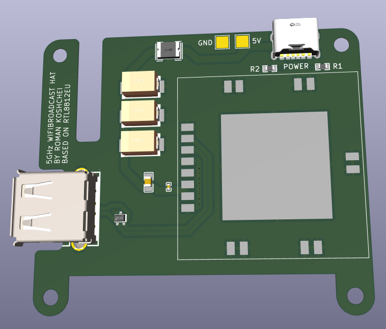
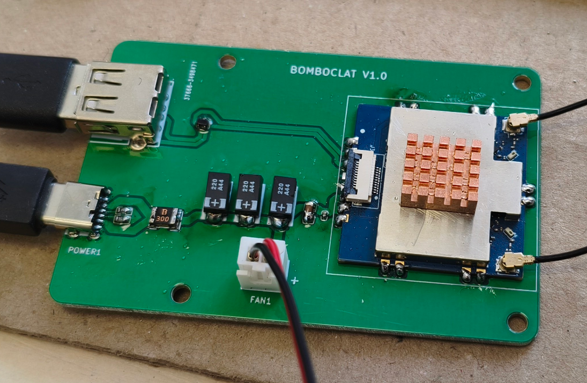

# 5GHz WiFi Broadcast HAT

A KiCad hardware design for a compact 5GHz WiFi Broadcast HAT.

It's based on RTL8812EU chipset inside BL-M8812EU2 module on the HAT.

Driver: [github.com/libc0607/rtl88x2eu-20230815](https://github.com/libc0607/rtl88x2eu-20230815)

Officially supported frequency: 5.15~5.85GHz.

**WARNING**: Use heatsink with fan like this one: [aliexpress.com/item/4000297043992.html](https://www.aliexpress.com/item/4000297043992.html).

**WARNING**: Connect antennas before usage.

Older version was bigger, this one was made more compact:

