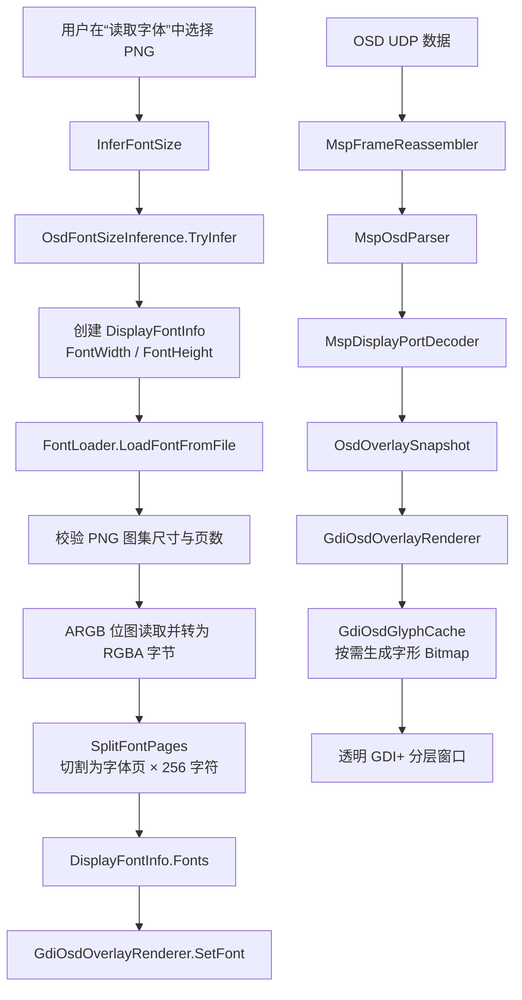

# OSD PNG Font Loading and Splitting Guide

This document describes how the **PNG bitmap font library used by the MSP DisplayPort OSD** in GroundConfiguration is loaded, validated, split, cached, and rendered onto a transparent GDI layer over the RTSP video.

> This document does not cover the TTF fonts used by standard WinForms controls. `MainFrm.ReloadFont()` uses the private font collection in `GD.Inst.TextPFC` to set the interface font; the OSD PNG font library uses a separate `DisplayFontInfo`, `FontLoader`, and `GdiOsdGlyphCache` pipeline.

## 1. Overall Data Flow

```mermaid
flowchart TD
    A[User selects PNG in "Read Font"] --> B[InferFontSize]
    B --> C[OsdFontSizeInference.TryInfer]
    C --> D[Create DisplayFontInfo\nFontWidth / FontHeight]
    D --> E[FontLoader.LoadFontFromFile]
    E --> F[Validate PNG atlas dimensions and page count]
    F --> G[Read ARGB bitmap and convert to RGBA bytes]
    G --> H[SplitFontPages\nSplit into font pages × 256 characters]
    H --> I[DisplayFontInfo.Fonts]
    I --> J[GdiOsdOverlayRenderer.SetFont]
    K[OSD UDP Data] --> L[MspFrameReassembler]
    L --> M[MspOsdParser]
    M --> N[MspDisplayPortDecoder]
    N --> O[OsdOverlaySnapshot]
    O --> P[GdiOsdOverlayRenderer]
    P --> Q[GdiOsdGlyphCache\nGenerate glyph Bitmaps on demand]
    Q --> R[Transparent GDI+ layered window]
```

The main pipeline can be summarized as:

```text
PNG atlas → RGBA font page cache → On-demand GDI glyph cache → MSP-specified page/character/coordinates → Transparent OSD layer
```

---

## 2. Loading Entry Point and Responsibility Division

### 2.1 User Selects a Font PNG

The "Read Font" menu handler in [MainFrm.cs](GroundConfiguration/00_View/MainFrm.cs#L967-L1001) performs the following tasks:

1. Opens a file selection dialog, allowing only `.png` files;
2. Attempts to set the default directory to `png加载字体\userfont`;
3. Calls `InferFontSize()` to infer the pixel dimensions of a single OSD character;
4. Creates a `DisplayFontInfo` using the inferred results;
5. Calls `FontLoader.LoadFontFromFile()` to read and split the PNG;
6. Passes the loading result to `_osdRenderer.SetFont(_osdFont)`.

Core call sequence:

```csharp
Size fontSize = InferFontSize(dialog.FileName);
_osdFont = new DisplayFontInfo
{
    FontWidth = fontSize.Width,
    FontHeight = fontSize.Height,
};

FontLoader.LoadFontFromFile(_osdFont, dialog.FileName);
_osdRenderer.SetFont(_osdFont);
```

### 2.2 Default Font Library Directory

[MainFrm.GetDefaultFontDirectory()](GroundConfiguration/00_View/MainFrm.cs#L1120-L1131) first attempts to backtrack from the application base directory to `png加载字体\userfont` in the source tree. If that path does not exist, it falls back to a subdirectory of the same name in the current working directory.

This directory is only the initial location for the file selection dialog; actual loading is based on the full file path selected by the user.

### 2.3 Data Semantics of `DisplayFontInfo`

[DisplayFontInfo.cs](GroundConfiguration/DisplayFontInfo.cs#L6-L18) is the container for loaded OSD font data:

| Field | Meaning |
| --- | --- |
| `FontWidth` | Pixel width of a single character |
| `FontHeight` | Pixel height of a single character |
| `Fonts` | Array of font pages; each element is the contiguous RGBA raw pixels of the 256 characters on that page |

The constructor initializes `Fonts = new byte[16][]`, supporting up to **16 font pages**.

---

## 3. Single Character Size Inference

Size inference is implemented in [OsdFontSizeInference.cs](GroundConfiguration/05_Device/OsdFontSizeInference.cs#L25-L73). The inference relies on both the filename and the actual image dimensions.

### 3.1 Filename Priority Rules

| Filename contains | Character width × height (pixels) |
| --- | --- |
| `_24` | 24 × 36 |
| `_36` | 36 × 54 |
| `540p` | 18 × 27 |
| `720p` | 24 × 36 |
| `1080p` | 36 × 54 |
| `1440p` | 48 × 72 |
| `2160p` | 72 × 108 |

### 3.2 Fallback Rules When No Naming Pattern Matches

- If `imageHeight` is divisible by `256`, the character height is `imageHeight / 256`; otherwise, inference fails.
- If `imageWidth` is divisible by `24`, the character width is preferably set to `24`; otherwise, the character width is set to the full image width.
- The inferred width and height must still evenly divide the actual image dimensions; otherwise, inference fails.

The `256` comes from the fixed number of glyphs each font page holds: `FontLoader.NumChars = 256`.

---

## 4. PNG Atlas Format Specification

### 4.1 Single-Page Format

Each font page contains exactly 256 characters arranged top-to-bottom:

```text
Page width  = FontWidth
Page height = FontHeight × 256

Character 0:   y =   0 × FontHeight
Character 1:   y =   1 × FontHeight
...
Character 255: y = 255 × FontHeight
```

Each character has a fixed size:

```text
FontWidth × FontHeight × 4 bytes (RGBA)
```

### 4.2 Multi-Page Atlas Format

A single PNG can contain multiple font pages. Pages may be arranged horizontally side-by-side or vertically stacked, with page numbering going "left to right, then top to bottom":

```text
+---------+---------+
| page 0  | page 1  |
+---------+---------+
| page 2  | page 3  |
+---------+---------+
```

For a given PNG:

```text
horizontalPages = imageWidth / FontWidth
verticalPages   = imageHeight / (FontHeight × 256)
numPages        = horizontalPages × verticalPages
```

Where `numPages` must not exceed `16`.

### 4.3 Loading Validation Conditions

[FontLoader.TryOpenFontFile()](GroundConfiguration/10_osd/FontLoader.cs#L143-L197) validates the following before actual splitting:

1. The file exists and can be opened by `System.Drawing.Bitmap`;
2. `imageHeight % (FontHeight × 256) == 0`;
3. `imageWidth % FontWidth == 0`;
4. Both the horizontal and vertical page counts are greater than 0;
5. The total page count does not exceed `FontLoader.NumFontPages`, i.e., `16`;
6. Both `FontWidth` and `FontHeight` are greater than 0.

If the file format does not match, the image cannot be read, or pixel locking fails, loading fails and the existing font page cache is cleared.

---

## 5. PNG Pixel Reading and RGBA Normalization

### 5.1 Unifying to Four-Channel ARGB Bitmap

[FontLoader.ConvertToArgbBitmap()](GroundConfiguration/10_osd/FontLoader.cs#L199-L203) clones the source image as `PixelFormat.Format32bppArgb`, ensuring that subsequent pixel reading is fixed at 4 bytes per pixel.

### 5.2 GDI+ Memory Byte Order Conversion

The in-memory channel byte order of `Format32bppArgb` is **B, G, R, A**. To unify the internal font library format,
[FontLoader.ReadRgbaImageData()](GroundConfiguration/10_osd/FontLoader.cs#L205-L241) uses `LockBits()` to read pixels and rearranges them to:

```text
R, G, B, A
```

That is:

```csharp
rgba[target]     = source[source + 2]; // R
rgba[target + 1] = source[source + 1]; // G
rgba[target + 2] = source[source];     // B
rgba[target + 3] = source[source + 3]; // A
```

The code also handles negative strides to ensure correct image row direction.

---

## 6. Splitting the Atlas into Font Pages

[FontLoader.SplitFontPages()](GroundConfiguration/10_osd/FontLoader.cs#L243-L281) handles the actual PNG splitting. After loading is complete, the original PNG is no longer involved in rendering; all glyphs are read from `DisplayFontInfo.Fonts`.

### 6.1 Memory Layout

Cache size per page:

```text
charWidthBytes = FontWidth × 4
charSizeBytes  = FontWidth × FontHeight × 4
pageSizeBytes  = charSizeBytes × 256
```

Final memory layout:

```text
Fonts[page]
  ├─ RGBA pixels of character 0x00 (FontWidth × FontHeight)
  ├─ RGBA pixels of character 0x01
  ├─ ...
  └─ RGBA pixels of character 0xFF
```

### 6.2 Splitting Algorithm

The splitting uses a four-level nested loop:

```text
verticalPage
  → horizontalPage
    → charIndex [0..255]
      → glyph row [0..FontHeight-1]
```

For each row of each character, `Buffer.BlockCopy()` is called to copy the corresponding character row from the source atlas to the target font page:

```csharp
Buffer.BlockCopy(rgbaImageData, sourceOffset, pageData, destinationOffset, charWidthBytes);
```

This way, each `Fonts[page]` is a contiguous block of RGBA data indexed by character code, and no further PNG cropping is needed at runtime.

### 6.3 Font Library Disposal

[FontLoader.CloseFont()](GroundConfiguration/10_osd/FontLoader.cs#L93-L104) sets all `Fonts[page]` to `null`. Exception handling paths during loading also call this method to prevent retaining incomplete or stale page data.

---

## 7. On-Demand GDI Glyph Cache Generation

After PNG splitting is complete, `Bitmap` objects are not immediately created for all `16 × 256` potential glyphs. GDI bitmaps are created and cached by [GdiOsdGlyphCache](GroundConfiguration/00_View/GdiOsdGlyphCache.cs#L15-L126) only when a character is actually drawn.

### 7.1 Cache Lookup

`GetGlyph(page, charIndex)` first validates:

- The character dimensions are valid;
- The page number is within the `Fonts` array bounds;
- The page has been loaded;
- The character code is in the `0..255` range;
- The byte range of the target glyph does not exceed bounds.

The cache key is:

```csharp
int key = (page << 8) | charIndex;
```

On the second use of the same `(font page, character code)` pair, the cached `Bitmap` is returned directly.

### 7.2 RGBA to Premultiplied BGRA

The transparent layered window uses `UpdateLayeredWindow`, and the GDI+ target bitmap uses `PixelFormat.Format32bppPArgb`. Therefore, when the glyph cache is created, conversion is performed via
[OsdPixelConverter.CopyRgbaToPremultipliedBgra()](GroundConfiguration/06_GstreamerRtsp/OsdPixelConverter.cs#L6-L74):

```text
Input: RGBA
Output: Premultiplied alpha BGRA
```

Each color channel is multiplied with alpha using the following formula:

```text
premultiplied = (color × alpha + 127) / 255
```

This conversion ensures that the transparent background and semi-transparent edges of the PNG composite correctly within the transparent OSD layer.

### 7.3 Resource Disposal

`GdiOsdGlyphCache.Dispose()` releases each cached `Bitmap` one by one and clears the dictionary. When the font is switched,
[GdiOsdOverlayRenderer.ApplyPendingFont()](GroundConfiguration/00_View/GdiOsdOverlayRenderer.cs#L249-L266) first releases the old cache before creating a new cache instance for the new font.

---

## 8. Rendering Pipeline from OSD Data to Screen Characters

Once the font is prepared, OSD UDP data determines "which character to draw and where" through the following path:

1. [MainFrm.HandleOsdDataReceived()](GroundConfiguration/00_View/MainFrm.cs#L124-L163) receives UDP data;
2. `MspFrameReassembler` accumulates and reassembles complete MSP frames spanning across UDP datagrams;
3. [MainFrm.TryRenderMspOsd()](GroundConfiguration/00_View/MainFrm.cs#L1030-L1071) calls `MspOsdParser` to parse the frame;
4. `MspDisplayPortDecoder.Apply()` applies DisplayPort commands to the persistent screen state and generates an `OsdOverlaySnapshot`;
5. `_osdRenderer.SetSnapshot(snapshot)` passes the snapshot to the GDI renderer;
6. `GdiOsdOverlayRenderer` generates a set of grid cells mapping "grid coordinates → character code/font page" from the snapshot;
7. For each cell, `_glyphCache.GetGlyph(cell.FontPage, cell.Character)` is called to obtain the corresponding `Bitmap`;
8. `OsdLayoutMapper` maps OSD logical coordinates to transparent window coordinates;
9. `Graphics.DrawImage()` is called to draw onto the backing surface of the transparent layered window.

Key drawing location: [GdiOsdOverlayRenderer.DrawCell()](GroundConfiguration/00_View/GdiOsdOverlayRenderer.cs#L276-L310).

The renderer explicitly uses:

```csharp
CompositingMode.SourceCopy
InterpolationMode.NearestNeighbor
PixelOffsetMode.Half
SmoothingMode.None
```

See: [GdiOsdOverlayRenderer.ConfigureGraphics()](GroundConfiguration/00_View/GdiOsdOverlayRenderer.cs#L268-L274). This prevents pixel fonts from becoming blurred due to linear interpolation or anti-aliasing.

---

## 9. Partial Refresh and Performance Strategy

[GdiOsdOverlayRenderer](GroundConfiguration/00_View/GdiOsdOverlayRenderer.cs#L18-L375) does not redraw the entire screen every time OSD data is received:

- On the first frame, font switch, transparent layer re-enable, or canvas size/layout change, a full refresh is performed;
- Normal updates compare old and new grid cells via `OsdGridDiff`;
- Only cells that have been removed or changed are cleared;
- Only changed cells are redrawn;
- Only the dirty rectangle formed by merging changed cells is committed;
- If the snapshot has not changed, the transparent window `Commit()` is not called.

Partial diff and commit logic: [GdiOsdOverlayRenderer.cs](GroundConfiguration/00_View/GdiOsdOverlayRenderer.cs#L208-L245).

Therefore, the performance design hierarchy is as follows:

```text
Loading phase: The entire PNG is read, converted, and split only once.
Runtime phase: A single glyph Bitmap is created only once, on first use.
Rendering phase: Only changed OSD grid cells and dirty rectangles are processed.
```

---

## 10. Maintenance Notes

1. **Do not change the convention of 256 characters per page.** This convention is used simultaneously by PNG size inference, page splitting, and character code indexing.
2. **Do not mix color orders.** The output of `FontLoader` is RGBA; the GDI transparent layer bitmap requires premultiplied BGRA. The conversion should remain in `OsdPixelConverter`.
3. **The font page limit is 16.** If the device protocol requires more font pages, `FontLoader.NumFontPages`, `DisplayFontInfo` initialization, and related tests must all be adjusted simultaneously.
4. **Switching fonts must release the old glyph cache.** Otherwise, old `Bitmap` objects will both consume GDI resources and potentially cause incorrect glyphs to be displayed.
5. **Pixel font scaling should continue to use nearest-neighbor interpolation.** Switching to default or high-quality interpolation will blur the edges.
6. **OSD display depends on the font being loaded.** `EnsureOsdFontLoaded()` checks whether the font is available using `Fonts[0] != null`; if not loaded, MSP OSD rendering is refused.
7. **Standard UI TTF fonts and OSD PNG font libraries are maintained independently.** Modifying the private font loading logic in `GdJsonSettingsStore` does not affect the pipeline described in this document.

---


# OSD PNG 字体加载与切割说明

本文说明 GroundConfiguration 中 **MSP DisplayPort OSD 使用的 PNG 位图字库**如何加载、验证、切割、缓存并渲染到 RTSP 视频上的透明 GDI 图层。


## 1. 整体数据流



主链路可概括为：

```text
PNG 图集 → RGBA 字体页缓存 → 按需 GDI 字形缓存 → MSP 指定的页/字符/坐标 → 透明 OSD 层
```

---

## 2. 加载入口与职责划分

### 2.1 用户选择字体 PNG

[MainFrm.cs](GroundConfiguration/00_View/MainFrm.cs#L967-L1001) 的“读取字体”菜单处理器完成以下工作：

1. 打开文件选择框，只允许选择 `.png`；
2. 尝试将默认目录设为 `png加载字体\userfont`；
3. 调用 `InferFontSize()` 推断单个 OSD 字符的像素宽高；
4. 用推断结果创建 `DisplayFontInfo`；
5. 调用 `FontLoader.LoadFontFromFile()` 读取与切割 PNG；
6. 将加载结果交给 `_osdRenderer.SetFont(_osdFont)`。

核心调用关系：

```csharp
Size fontSize = InferFontSize(dialog.FileName);
_osdFont = new DisplayFontInfo
{
    FontWidth = fontSize.Width,
    FontHeight = fontSize.Height,
};

FontLoader.LoadFontFromFile(_osdFont, dialog.FileName);
_osdRenderer.SetFont(_osdFont);
```

### 2.2 默认字库目录

[MainFrm.GetDefaultFontDirectory()](GroundConfiguration/00_View/MainFrm.cs#L1120-L1131) 优先尝试从应用基目录回溯至源码树中的 `png加载字体\userfont`。如果该路径不存在，则回退为当前工作目录下的同名子目录。

该目录只是打开文件选择器的初始位置；实际加载以用户选中的完整文件路径为准。

### 2.3 `DisplayFontInfo` 的数据含义

[DisplayFontInfo.cs](GroundConfiguration/DisplayFontInfo.cs#L6-L18) 是加载后的 OSD 字体数据容器：

| 字段 | 含义 |
| --- | --- |
| `FontWidth` | 单个字符的像素宽度 |
| `FontHeight` | 单个字符的像素高度 |
| `Fonts` | 字体页数组；每个元素是该页 256 个字符连续排列的 RGBA 原始像素 |

构造函数会初始化 `Fonts = new byte[16][]`，即最多支持 **16 个字体页**。

---

## 3. 单字符尺寸推断

尺寸推断在 [OsdFontSizeInference.cs](GroundConfiguration/05_Device/OsdFontSizeInference.cs#L25-L73) 中实现。推断同时依赖文件名和图片实际尺寸。

### 3.1 文件名优先规则

| 文件名包含 | 字符宽 × 高（像素） |
| --- | --- |
| `_24` | 24 × 36 |
| `_36` | 36 × 54 |
| `540p` | 18 × 27 |
| `720p` | 24 × 36 |
| `1080p` | 36 × 54 |
| `1440p` | 48 × 72 |
| `2160p` | 72 × 108 |

### 3.2 无命名特征时的回退规则

- 如果 `imageHeight` 能被 `256` 整除，字符高度为 `imageHeight / 256`；否则推断失败。
- 如果 `imageWidth` 能被 `24` 整除，字符宽度优先取 `24`；否则字符宽度取整张图片宽度。
- 推断得到的宽、高仍必须能被实际图片尺寸整除，否则返回失败。

`256` 来自每个字体页固定容纳的字形数量：`FontLoader.NumChars = 256`。

---

## 4. PNG 图集格式规范

### 4.1 单页格式

每个字体页固定包含 256 个字符，按从上到下顺序排列：

```text
页宽  = FontWidth
页高  = FontHeight × 256

第 0 个字符： y =   0 × FontHeight
第 1 个字符： y =   1 × FontHeight
...
第 255 个字符：y = 255 × FontHeight
```

每个字符均为固定尺寸：

```text
FontWidth × FontHeight × 4 字节（RGBA）
```

### 4.2 多页图集格式

同一个 PNG 可以包含多个字体页。页面允许横向并排、纵向堆叠，页编号为“先左到右，再上到下”：

```text
+---------+---------+
| page 0  | page 1  |
+---------+---------+
| page 2  | page 3  |
+---------+---------+
```

对一个 PNG：

```text
horizontalPages = imageWidth / FontWidth
verticalPages   = imageHeight / (FontHeight × 256)
numPages        = horizontalPages × verticalPages
```

其中 `numPages` 必须不超过 `16`。

### 4.3 加载校验条件

[FontLoader.TryOpenFontFile()](GroundConfiguration/10_osd/FontLoader.cs#L143-L197) 在实际切割前校验：

1. 文件存在且可由 `System.Drawing.Bitmap` 打开；
2. `imageHeight % (FontHeight × 256) == 0`；
3. `imageWidth % FontWidth == 0`；
4. 横向页数、纵向页数均大于 0；
5. 总页数不超过 `FontLoader.NumFontPages`，即 `16`；
6. `FontWidth`、`FontHeight` 均大于 0。

文件格式不匹配、图片无法读取或像素锁定失败时，加载失败并清理已有字体页缓存。

---

## 5. PNG 像素读取与 RGBA 标准化

### 5.1 统一为四通道 ARGB 位图

[FontLoader.ConvertToArgbBitmap()](GroundConfiguration/10_osd/FontLoader.cs#L199-L203) 将源图片克隆为 `PixelFormat.Format32bppArgb`，使后续像素读取固定为每像素 4 字节。

### 5.2 GDI+ 内存字节顺序转换

`Format32bppArgb` 在内存中的通道字节顺序是 **B、G、R、A**。为让字库内部格式统一，
[FontLoader.ReadRgbaImageData()](GroundConfiguration/10_osd/FontLoader.cs#L205-L241) 使用 `LockBits()` 读取像素并重排为：

```text
R, G, B, A
```

即：

```csharp
rgba[target]     = source[source + 2]; // R
rgba[target + 1] = source[source + 1]; // G
rgba[target + 2] = source[source];     // B
rgba[target + 3] = source[source + 3]; // A
```

代码同时处理负 stride，以保证图像行方向正确。

---

## 6. 图集切割为字体页

[FontLoader.SplitFontPages()](GroundConfiguration/10_osd/FontLoader.cs#L243-L281) 负责真正的 PNG 切割。加载完成后，原始 PNG 不再参与渲染，所有字形均从 `DisplayFontInfo.Fonts` 读取。

### 6.1 内存布局

每页缓存大小：

```text
charWidthBytes = FontWidth × 4
charSizeBytes  = FontWidth × FontHeight × 4
pageSizeBytes  = charSizeBytes × 256
```

最终内存布局：

```text
Fonts[page]
  ├─ 字符 0x00 的 RGBA 像素（FontWidth × FontHeight）
  ├─ 字符 0x01 的 RGBA 像素
  ├─ ...
  └─ 字符 0xFF 的 RGBA 像素
```

### 6.2 切割算法

切割使用四层循环：

```text
verticalPage
  → horizontalPage
    → charIndex [0..255]
      → glyph row [0..FontHeight-1]
```

对每个字符的每一行，调用 `Buffer.BlockCopy()` 将源图集中对应的一个字符行复制到目标字体页：

```csharp
Buffer.BlockCopy(rgbaImageData, sourceOffset, pageData, destinationOffset, charWidthBytes);
```

这样每个 `Fonts[page]` 都是一段连续的、按字符索引定位的 RGBA 数据，运行时不需要再次裁剪 PNG。

### 6.3 字库释放

[FontLoader.CloseFont()](GroundConfiguration/10_osd/FontLoader.cs#L93-L104) 会将所有 `Fonts[page]` 置为 `null`。加载异常路径也会调用该方法，防止保留不完整或失效的页数据。

---

## 7. 按需生成 GDI 字形缓存

PNG 切割完成后，并不会立即为全部 `16 × 256` 个潜在字形创建 `Bitmap`。GDI 位图在实际绘制某个字符时才由 [GdiOsdGlyphCache](GroundConfiguration/00_View/GdiOsdGlyphCache.cs#L15-L126) 创建并缓存。

### 7.1 缓存查找

`GetGlyph(page, charIndex)` 先验证：

- 字符尺寸有效；
- 页号处于 `Fonts` 数组范围；
- 该页已经加载；
- 字符码在 `0..255` 范围；
- 目标字形的字节范围没有越界。

缓存键为：

```csharp
int key = (page << 8) | charIndex;
```

同一个 `(字体页, 字符码)` 第二次使用时，直接返回缓存的 `Bitmap`。

### 7.2 RGBA 转预乘 BGRA

透明分层窗口使用 `UpdateLayeredWindow`，GDI+ 目标位图采用 `PixelFormat.Format32bppPArgb`。因此，字形缓存创建时会通过
[OsdPixelConverter.CopyRgbaToPremultipliedBgra()](GroundConfiguration/06_GstreamerRtsp/OsdPixelConverter.cs#L6-L74) 转换：

```text
输入：RGBA
输出：预乘 Alpha 的 BGRA
```

每个颜色通道按以下公式与 Alpha 相乘：

```text
premultiplied = (color × alpha + 127) / 255
```

这种转换使 PNG 的透明背景和半透明边缘能在透明 OSD 层中正确合成。

### 7.3 资源释放

`GdiOsdGlyphCache.Dispose()` 会逐个释放缓存的 `Bitmap` 并清空字典。字体发生切换时，
[GdiOsdOverlayRenderer.ApplyPendingFont()](GroundConfiguration/00_View/GdiOsdOverlayRenderer.cs#L249-L266) 会先释放旧缓存，再创建新字体对应的缓存实例。

---

## 8. OSD 数据到屏幕字符的渲染链路

字体准备完成后，OSD UDP 数据通过以下路径决定“画哪个字、画在何处”。

1. [MainFrm.HandleOsdDataReceived()](GroundConfiguration/00_View/MainFrm.cs#L124-L163) 接收 UDP 数据；
2. `MspFrameReassembler` 累积并拼接跨 UDP 数据报的完整 MSP 帧；
3. [MainFrm.TryRenderMspOsd()](GroundConfiguration/00_View/MainFrm.cs#L1030-L1071) 调用 `MspOsdParser` 解析帧；
4. `MspDisplayPortDecoder.Apply()` 将 DisplayPort 命令应用到持久屏幕状态，并生成 `OsdOverlaySnapshot`；
5. `_osdRenderer.SetSnapshot(snapshot)` 把快照交给 GDI 渲染器；
6. `GdiOsdOverlayRenderer` 从快照生成“网格坐标 → 字符码/字体页”的字格集合；
7. 每个字格调用 `_glyphCache.GetGlyph(cell.FontPage, cell.Character)` 获取对应 `Bitmap`；
8. 通过 `OsdLayoutMapper` 将 OSD 逻辑坐标映射到透明窗口坐标；
9. 调用 `Graphics.DrawImage()` 画到透明分层窗口的后备面。

关键绘制位置见：[GdiOsdOverlayRenderer.DrawCell()](GroundConfiguration/00_View/GdiOsdOverlayRenderer.cs#L276-L310)。

渲染器明确使用：

```csharp
CompositingMode.SourceCopy
InterpolationMode.NearestNeighbor
PixelOffsetMode.Half
SmoothingMode.None
```

见：[GdiOsdOverlayRenderer.ConfigureGraphics()](GroundConfiguration/00_View/GdiOsdOverlayRenderer.cs#L268-L274)。这能避免像素字体被线性插值或抗锯齿处理后变模糊。

---

## 9. 局部刷新与性能策略

[GdiOsdOverlayRenderer](GroundConfiguration/00_View/GdiOsdOverlayRenderer.cs#L18-L375) 不是每次收到 OSD 数据都重画整屏：

- 首帧、字体切换、透明层重新启用、画布尺寸或布局变化时，执行全量刷新；
- 普通更新通过 `OsdGridDiff` 对比新旧字格；
- 仅清除已移除或发生变化的格子；
- 仅重绘变化格子；
- 仅提交变化格子合并得到的脏矩形；
- 如果快照没有变化，不调用透明窗口 `Commit()`。

局部差异与提交逻辑见：[GdiOsdOverlayRenderer.cs](GroundConfiguration/00_View/GdiOsdOverlayRenderer.cs#L208-L245)。

因此性能设计层次如下：

```text
加载期：整张 PNG 只读取、转换、切割一次。
运行期：单个字形 Bitmap 仅在第一次需要时创建一次。
渲染期：仅处理发生变化的 OSD 字格和脏矩形。
```

---

## 10. 维护注意事项

1. **不要改变每页 256 字符的约定。** 该约定同时被 PNG 尺寸推断、页面切割和字符码索引使用。
2. **不要混用颜色顺序。** `FontLoader` 的输出是 RGBA；GDI 透明层位图需要预乘 BGRA，转换应保留在 `OsdPixelConverter`。
3. **字体页上限为 16。** 若设备协议需要更多字体页，需要同时调整 `FontLoader.NumFontPages`、`DisplayFontInfo` 初始化和相关测试。
4. **切换字体必须释放旧字形缓存。** 否则旧的 `Bitmap` 既会占用 GDI 资源，也可能导致显示到错误字形。
5. **像素字体缩放应继续使用最近邻插值。** 更换为默认或高质量插值会使边缘模糊。
6. **OSD 的显示依赖字体已加载。** `EnsureOsdFontLoaded()` 以 `Fonts[0] != null` 判断字体是否可用；未加载时会拒绝 MSP OSD 渲染。
7. **普通 UI TTF 字体与 OSD PNG 字库独立维护。** 修改 `GdJsonSettingsStore` 的私有字体加载逻辑不会影响本文链路。

---


