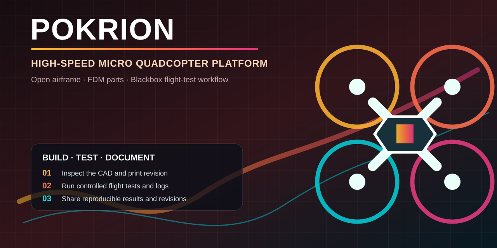

# POKRION — High-Speed Micro Quadcopter Platform

  

  <strong>Open airframe references and a reproducible Blackbox flight-test workflow for high-speed micro-quadcopter research.</strong> 
  If this platform makes a build or test easier to reproduce, <a href="https://github.com/pokrc/POKRION-Speed-Drone/stargazers">Star it</a> to keep open high-speed micro-drone work discoverable.

**POKRION** is an experimental, high-speed micro quadcopter platform developed by the POK-RC team. It combines lightweight airframe design, aerodynamic fairings, high-power micro motors, digital video, and Blackbox-driven flight-test iteration.

This repository is intended to make the design easier to inspect, reproduce, discuss, and improve. It is an engineering reference—not a certified aircraft, a universal build recipe, or a guarantee of speed, flight time, or structural safety.

> **Current status:** active experimental development. Dimensions, materials, propellers, electronics, and flight-control settings may change between revisions. Always inspect the files and configuration before manufacturing or flight testing.

## Project at a glance

| Focus | What is published | How to use it responsibly |
| --- | --- | --- |
| High-speed micro quadcopter R&D | Printable airframe parts, selected propeller models, frame/mount references, and a flight-controller reference configuration | Start from the named revision; inspect clearances, structural condition, and electrical compatibility before power-up |
| Repeatable flight testing | Blackbox-aware workflow, configuration backup guidance, and a companion local analysis skill | Change one parameter family at a time, retain the `.bbl` and `diff all`, then record motor-temperature results |
| Open engineering exchange | Issues, Discussions, reproducible test reports, and citation metadata | Share observations with hardware revision, mass, material, propeller, battery, firmware, and test conditions |

## Start here

- **Understand the platform:** read the [reference hardware](#reference-hardware-configuration), [repository map](#repository-map), and [build workflow](#build-workflow).
- **Inspect printable parts:** open the [`3d_printed_parts/`](3d_printed_parts/) directory and compare the STL/3MF revision with your intended printer and material.
- **Review the flight stack:** read [`betaflight_config.txt`](betaflight_config.txt) as a reference only, then make your own backup with `diff all` before changing a controller.
- **Analyze a flight:** use the companion [Tune Betaflight PID from Blackbox Logs](https://github.com/pokrc/tune-betaflight-pid) project with a raw `.bbl` log. Its local readiness check verifies the decoder and dependencies before its adaptive workflow selects a conservative evidence-gated CLI stage instead of forcing a PID change for every flight.
- **Join the project:** report a reproducible result in [Issues](https://github.com/pokrc/POKRION-Speed-Drone/issues) or propose a documented change in a pull request.

## Why POKRION

- **Small airframe, serious test discipline.** The platform explores high-speed performance in a compact micro-quadcopter format.
- **Aerodynamics are part of the system.** Shells, fairings, motor flow, cooling, antenna placement, and cable routing are treated as flight-performance variables.
- **Manufacturing is documented.** The repository includes printable STL/3MF assets plus additional frame and motor-mount references.
- **Flight decisions are evidence-based.** Blackbox logs, motor temperature, current, vibration, and controlled A/B tests are preferred over guesswork.
- **Open engineering discussion.** Builders can report a revision, test condition, result, and failure mode without needing to reverse-engineer the whole project first.

## Reference hardware configuration

The following configuration reflects a representative test setup. It is not a mandatory bill of materials and should not be copied without checking electrical, mechanical, and thermal compatibility.

| Subsystem | Reference configuration |
| --- | --- |
| Flight controller | SpeedyBee F405 AIO V2, Betaflight 4.5.x |
| Motors | AMAX 1507, 3000KV class |
| Battery | 6S 650 mAh LiPo, approximately 95C class |
| Video | DJI O4 Air Unit |
| Navigation | BZ-121 GPS reference hardware |
| Airframe | Lightweight printed shells/fairings plus frame and motor-mount references |
| Tuning workflow | Betaflight Blackbox, RPM-filter verification, staged PID/filter tests |

The actual safe operating point depends on motor winding, ESC limits, propeller load, battery condition, cooling, airframe mass, and local regulations.

## Repository map

| Path | What it contains | Notes |
| --- | --- | --- |
| [`3d_printed_parts/`](3d_printed_parts/) | Canopy, upper/lower shells, motor fairing, propeller box, and 3MF print assets | Review the file revision and print profile before use |
| [`carbon_fiber_frame/`](carbon_fiber_frame/) | Battery plate, frame mount, and main-frame references | Treat these as revision-specific design references |
| [`cnc_motor_mount/`](cnc_motor_mount/) | CNC motor-mount reference file | Confirm units, tolerances, and hole pattern in CAD before machining |
| [`propellers/`](propellers/) | CW/CCW propeller models marked for the open release | Balance and inspect every propeller before flight |
| [`betaflight_config.txt`](betaflight_config.txt) | Reference flight-controller configuration | Do not paste blindly; audit every setting |
| [`guinness_rules_en.pdf`](guinness_rules_en.pdf) | English rules/reference document included with the project | Verify the current official rules independently |
| [`guinness_rules_cn.pdf`](guinness_rules_cn.pdf) | Chinese rules/reference document | Provided for reference only |
| [`LICENSE.txt`](LICENSE.txt) | Project license and attribution requirements | CC BY-NC-SA 4.0; exclusions are stated in the README and license |

## Open-source scope

The repository currently publishes selected airframe and aerodynamic design material, including printable structural parts, fairings, and the open-release two-blade propeller models. Some POKRION propeller variants, launch-stand files, test fixtures, and other unreleased work are intentionally excluded.

A file being visible in the repository does not automatically mean that it is approved for commercial manufacture or unrestricted redistribution. Read [`LICENSE.txt`](LICENSE.txt) before copying, modifying, manufacturing, or publishing derivatives.

## Build workflow

1. **Choose a revision.** Record the commit, file names, material, print process, and hardware revision before starting.
2. **Inspect the geometry.** Check wall thickness, clearances, motor-hole pattern, propeller clearance, cooling paths, antenna clearance, and battery retention.
3. **Validate the manufacturing process.** Confirm printer calibration, material drying, layer adhesion, anisotropy, support strategy, and post-processing.
4. **Check the power system.** Verify motor/propeller load, ESC current capability, battery voltage, connector quality, polarity, solder joints, and insulation.
5. **Dry-fit before power.** Confirm that no printed part, fastener, cable, or fairing can contact a motor bell or propeller arc.
6. **Bench test without propellers.** Verify motor order/direction, receiver failsafe, arming logic, current-sensor sanity, video, GPS, and Blackbox logging.
7. **Perform a short controlled flight test.** Use a legal, clear area and a known-good battery and propeller set. Land early if temperature, sound, vibration, or control response is abnormal.
8. **Record evidence.** Save the configuration backup, flight log, battery state, weather, test duration, peak current, motor temperature, and any incident.

## Flight-data and PID workflow

Do not tune the final aircraft from a propeller-less ARM test. A motor page is an open-loop check; it does not reproduce the closed-loop gyro/PID/motor interaction that occurs in flight.

For a structured Blackbox workflow, see the companion project:

**[Tune Betaflight PID from Blackbox Logs](https://github.com/pokrc/tune-betaflight-pid)**

It analyzes `.bbl` logs locally, checks quality gates, compares matched flight windows, verifies RPM evidence, and selects an adaptive CLI stage: hold, RPM validation/setup, retain, TPA-only, or bounded noise reduction. Use its `doctor.py` readiness check before the first local deployment, then keep the `.bbl`, saved `diff all`, generated `analysis.json`, and motor-temperature result together as one test record. RPM setup requires ESC bidirectional-DShot confirmation and the actual magnet count on the motor bell; never infer it from a previous configuration. A generated CLI is a reviewable candidate, not permission to skip mechanical inspection or temperature checks.

## Safety and responsible use

High-energy LiPo batteries, rotating propellers, high-current wiring, hot motors, and high-speed flight can cause serious injury, fire, or property damage. Users are responsible for:

- removing propellers during all bench and configuration work;
- using a suitable fire-safe battery workflow and inspecting packs before use;
- checking local aviation, radio, privacy, and public-safety rules;
- testing only in a clear area with an appropriate recovery and emergency plan;
- stopping immediately after a hard impact, propeller strike, failsafe, loss of control, or abnormal motor temperature;
- verifying every firmware, ESC, motor, propeller, and battery setting on the actual aircraft.

This project is not intended for military, weapon, armed, or combat applications. No project file is a safety certification, airworthiness approval, or performance guarantee.

## Known limitations

- The repository does not provide a universal BOM, validated print profile for every printer/material, or a certified structural analysis.
- STL and 3MF files are manufacturing artifacts; they are not a substitute for editable source CAD or dimensional inspection.
- A reference Betaflight configuration may contain hardware-specific assumptions and must be audited before use.
- Published flight results are revision-dependent and are not directly comparable unless mass, battery, propeller, firmware, weather, and test method are matched.
- Some files are explicitly outside the open-source release. Commercial rights require separate written permission.

## Contributing and discussion

Use [Discussions](https://github.com/pokrc/POKRION-Speed-Drone/discussions) for build questions, ideas, and test notes; use the structured issue form for a reproducible result or problem. A useful report includes the commit or revision, airframe mass, material and print settings, motor/propeller/battery combination, firmware, test conditions, log evidence, and the smallest reproducible change.

Please do not upload GitHub tokens, receiver identifiers, private flight data, personal addresses, or other credentials. For large binary revisions, explain the change in an issue or pull request before adding files.

If POKRION helps your research or build, a voluntary **Star** makes the project easier for other builders to discover. Sharing a specific build result or a reproducible failure is even more valuable:

<https://github.com/pokrc/POKRION-Speed-Drone>

## Team and attribution

Developed by the **POK-RC team**:

- Yao Siqi
- Guo Jiyuan
- Zhang Wei

Some early structural concepts were informed by publicly shared work from Sunny (PROWESS V1.2). POKRION includes substantial redesign and implementation changes, including revised structural layouts, internal routing, aerodynamic parts, and motor-mount integration.

When redistributing or modifying this work, retain the attribution and license terms in [`LICENSE.txt`](LICENSE.txt), identify changes, and credit the POK-RC team as the original developer.

## License

Unless a file states otherwise, this project is released under the [Creative Commons Attribution-NonCommercial-ShareAlike 4.0 International License](LICENSE.txt). You may study, share, and adapt the material for research, education, and personal non-commercial experimentation when you provide attribution and share derivatives under the same license. Commercial use requires separate written permission from the copyright holder.

Copyright © 2026 POK-RC Team (POK_RC YAO). All rights reserved except for the rights expressly granted by the license.
