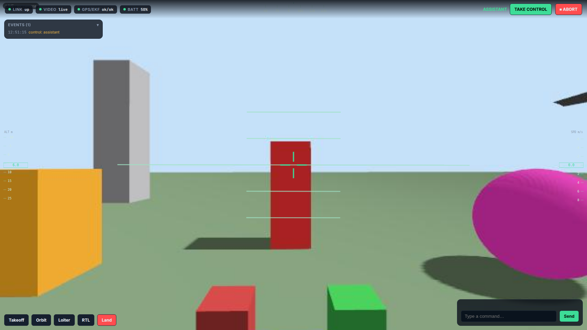
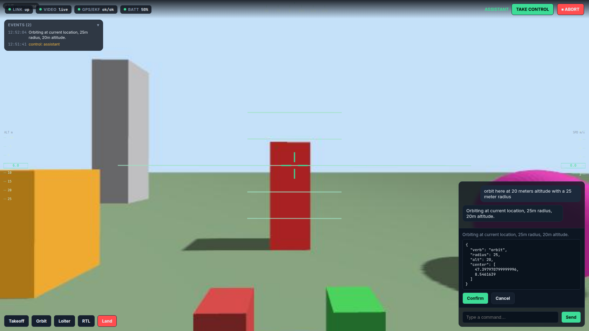
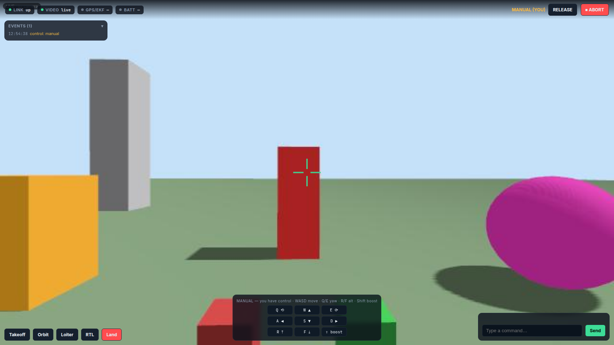
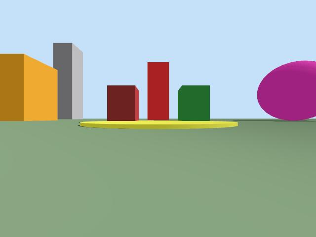
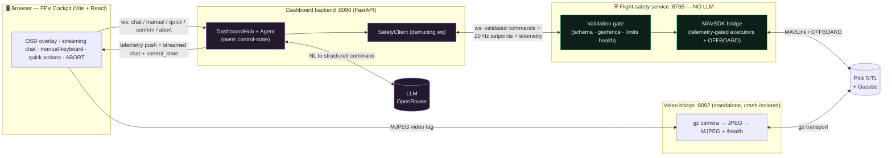
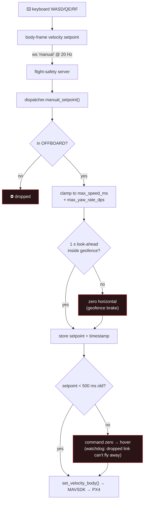
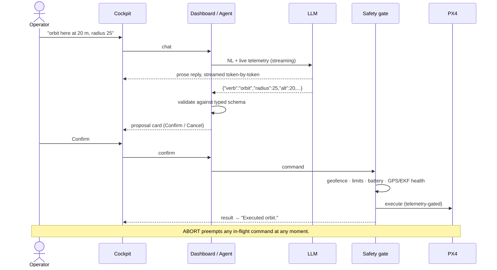

<div align="center">

# LLM FPV Flight Assistant

**A model-agnostic LLM copilot for an FPV drone — natural-language command & control with a deterministic safety layer that keeps the AI out of the hard real-time loop.**

[](LICENSE)
[](https://www.python.org/)
[](https://react.dev/)
[](https://px4.io/)
[](#testing)



</div>

---

## What this is

The human flies an FPV drone manually and **delegates tasks to an assistant in natural language** ("orbit that area at 20 m", "return to launch"). The assistant proposes a structured command; a **deterministic flight-safety layer validates and executes it**; the human can take the sticks back at any time. The defining rule:

> **The LLM never sits in the hard real-time control loop.** It proposes — a validation gate decides — the human stays in command.

Everything is developed **SITL-first** on **PX4 + Gazebo (gz Harmonic)**, so you can run the whole thing on a laptop with no hardware. It's model-agnostic via OpenRouter (any OpenAI-compatible endpoint).

> ⚠️ **Simulation project.** This is a research/education codebase validated in SITL. Do not fly it on a real airframe without your own safety review, geofencing, and regulatory compliance.

---

## Highlights

- 🛡️ **Authoritative safety gate** — a deterministic, LLM-free service validates every command against a typed schema, geofence, altitude/speed limits, and live telemetry health before any actuation.
- 🗣️ **Streaming natural-language control** — type a request; the assistant streams its reply token-by-token (with a "thinking" trace when the model exposes reasoning), proposes a validated command, and waits for your **Confirm**.
- 🎮 **Gate-validated manual flight** — take the sticks with the keyboard (WASD / Q-E / R-F). Every velocity setpoint is clamped to safe limits, geofence-braked, and protected by a **500 ms hover watchdog** — the browser never drives the vehicle directly.
- 📹 **Real onboard camera** — the live Gazebo camera is streamed as MJPEG from a crash-isolated bridge process, with an automatic Three.js telemetry fallback if the feed drops.
- 🧭 **Immersive FPV/OSD cockpit** — full-bleed video with attitude horizon, compass tape, altitude/speed ladders, health chips, quick-action buttons, and a live event log.
- 🔌 **Model-agnostic** — OpenRouter / any OpenAI-compatible API; swap models with one env var.
- 📊 **Eval harness** — a deterministic benchmark scores any model's NL→command quality against the schema + safety gate (no SITL needed): happy-path accuracy, ask-when-ambiguous, **unsafe→gate-rejects**, and never-invent-coordinates → a Markdown/JSON scorecard for cross-model regression tracking.

---

## Screenshots

| Natural-language → validated command | Manual keyboard control |
|:---:|:---:|
|  |  |
| Streamed assistant reply + the exact JSON command the gate will run, behind a **Confirm/Cancel** gate. | **MANUAL (YOU)** mode: live keyboard HUD; setpoints stream through the safety gate at 20 Hz. |

<div align="center">

**Live onboard camera (Gazebo, headless EGL):**



</div>

---

## Architecture

Three independent processes behind a hard trust boundary. The **LLM lives only on the assistant side** and can never reach the vehicle except through the validated safety API.



### The safety invariant — every manual setpoint passes the gate

The browser sends *desired velocity*, not motor commands. The gate clamps, geofence-brakes, and watchdogs it before anything reaches MAVSDK.



### Natural-language command flow



---

## Tech stack

| Layer | Tech |
|---|---|
| **Flight-safety service** | Python 3.11 · FastAPI · websockets · MAVSDK-Python · pydantic |
| **Assistant** | OpenRouter (OpenAI-compatible) · constrained JSON output (not tool-calling) · streaming |
| **Video bridge** | gz-transport Python bindings · Pillow · MJPEG over FastAPI |
| **Frontend** | Vite · React 18 · TypeScript · react-three-fiber · Vitest |
| **Simulator** | PX4 SITL · Gazebo (gz Harmonic) · headless EGL rendering |

---

## Repository layout

```
src/flight_safety/   the trusted core — NO LLM: config, command schema, geofence,
                     validation gate, MAVSDK bridge (OFFBOARD), dispatcher, ws server
src/assistant/       the LLM side: provider, streaming command generation,
                     demuxing safety-client, agent, CLI
src/video_bridge/    standalone gz-camera → MJPEG process (+ /health)
src/dashboard/       dashboard backend: hub orchestration, broadcaster, ws app
src/eval_harness/    eval harness: NL→command quality benchmark (cases, runner,
                     deterministic scorer, scorecard report, CLI) vs schema + gate
frontend/            Vite + React + react-three-fiber FPV/OSD cockpit
evals/               curated NL→command test cases (results/ gitignored)
tests/               pytest (unit + SITL/API-gated integration) · Vitest
docs/                design specs, implementation plans, eval baselines, ROADMAP
```

The full project tracker, conventions, and hard-won gotchas live in **[`ROADMAP.md`](ROADMAP.md)**.

---

## Getting started

### Prerequisites
- PX4-Autopilot built for SITL with Gazebo (gz Harmonic) — see the PX4 docs.
- Python 3.11 (project venv) and Node.js for the frontend.
- An OpenRouter API key (or any OpenAI-compatible endpoint).

### Install
```bash
python -m venv .venv && . .venv/bin/activate
pip install -e .
npm --prefix frontend install
cp .env.example .env        # then add your AS_OPENROUTER_API_KEY
```
Secrets live in `.env` (gitignored). `FS_GEOFENCE` must contain the SITL home (~47.398, 8.546) or commands are rejected as out-of-bounds.

### Run (each in its own terminal)
```bash
# 1) Simulator — camera airframe + landmark test world
PX4_GZ_WORLD=cam_test HEADLESS=1 make -C /path/to/PX4-Autopilot px4_sitl gz_x500_mono_cam

# 2) Flight-safety service (no LLM) — ws on 127.0.0.1:8765
python -m flight_safety

# 3) Video bridge → MJPEG on :8092
#    NOTE: gz Python bindings live in the SYSTEM interpreter, not the venv.
PYTHONPATH=src VB_TOPIC="/world/cam_test/model/x500_mono_cam_0/link/camera_link/sensor/camera/image" \
  VB_PORT=8092 /usr/bin/python3 -m video_bridge

# 4) Dashboard backend → http://<host>:8090
npm --prefix frontend run build
DASH_PORT=8090 python -m dashboard
```
Open **http://&lt;host&gt;:8090**, then: type a command → **Confirm**, or click **TAKE CONTROL** and fly with **WASD / Q-E / R-F** (Shift = boost). **ABORT** is always live.

> Default ports `8080/8082` are assumed free; this repo's examples use `8090/8092` because they were taken on the dev box. See `ROADMAP.md` for the full set of operational gotchas.

---

## Testing

```bash
pytest -q                       # Python unit suite (170 passing)
npm --prefix frontend test      # frontend unit suite (Vitest, 25 passing)
pytest -m integration -v        # live integration (SITL e2e + 1 eval live smoke)
python -m eval_harness --models "$AS_MODEL"   # benchmark a model → scorecard (docs/evals/)
```

The validation gate, geofence brake, manual-setpoint clamping, OFFBOARD watchdog, and streaming chat parser are all unit-tested. The end-to-end flow (NL → propose → confirm → execute, plus take-control → manual setpoints → release) is verified live in SITL. The **eval harness** scores NL→command quality deterministically against the schema + gate (offline, CI-safe) and benchmarks real models on demand; a dated baseline lives in [`docs/evals/`](docs/evals/).

---

## Project status

- [x] **M1 — Flight-safety service** — validation gate, MAVSDK bridge, hand-off, abort. *Merged · validated live.*
- [x] **M2 — Assistant core** — model-agnostic LLM, constrained command generation, agent loop, CLI. *Merged · validated live.*
- [x] **M3 — FPV web dashboard** — real gz camera over MJPEG, telemetry HUD, chat with confirm, ABORT. *Merged · validated live.*
- [x] **Cockpit v2** — gate-validated manual flight, streaming chat, immersive OSD redesign. *Merged · validated live.*
- [x] **M4 — Eval harness** — deterministic NL→command quality benchmark (schema + gate oracle), offline CI tier + live cross-model scorecard. *Merged · validated live (92% / gate-agreement 100% on `deepseek-v4-flash`).*
- [ ] **Next** — voice I/O; Turkish-language support; VLM "see-and-describe" narration; on-screen joysticks / gamepad.

---

## Acknowledgements

Built on the excellent open-source work of [PX4](https://px4.io/), [Gazebo](https://gazebosim.org/), and [MAVSDK](https://mavsdk.mavlink.io/). Model access via [OpenRouter](https://openrouter.ai/).

## License

[MIT](LICENSE) © 2026 Ali Kendir
