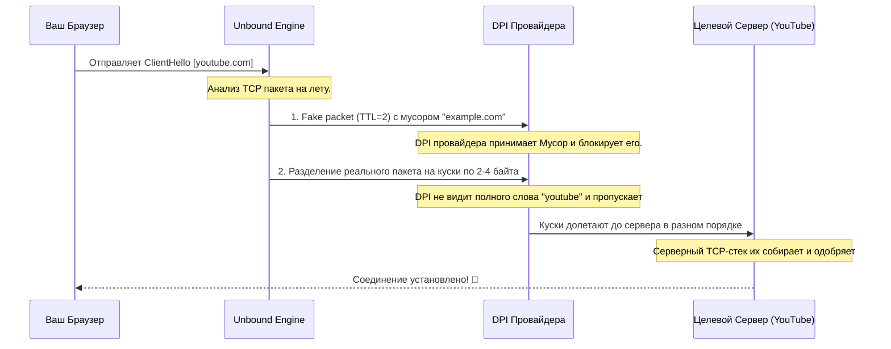

# 🚀 UNBOUND v2.5.0

> Картка виставки. Зал: [Інше](../halls/other.md).

## Паспорт

| Поле | Значення |
|------|----------|
| Джерело | [RSTKCodeWP/unbound](https://github.com/RSTKCodeWP/unbound) |
| Локальна тека | `unbound-Lua-Universal-DPI-Bypass` |
| У бібліотеці | keep |
| Категорії каталогу | `other` |
| Зірки (каталог) | — |
| Оновлено upstream | — |
| Ліцензія (з файлу LICENSE або згадки) | GPL-3.0 |

## Ідея

**Мультиплатформенная пушка для прозрачного обхода DPI-блокировок.** <br> *Zero latency. Zero overhead. Zero VPN.*

_З README.md, без переказу._

## Для чого

**Мультиплатформенная пушка для прозрачного обхода DPI-блокировок.** <br> *Zero latency. Zero overhead. Zero VPN.*

_Окремого опису в каталозі немає. Це перший абзац README._

## Для кого

Аудиторія прямо не названа, і в описі немає маркерів (GCS, OSD, ELRS, прошивка, OpenIPC, KiCad).

## Функція

Окремого списку функцій у README немає.

## Як влаштовано

Корінь теки (без прихованих і без `node_modules` / `.git`):

- `app.go`
- `app_linux.go`
- `app_test.go`
- `app_tray.go`
- `app_tray_darwin.go`
- `app_tray_linux.go`
- `app_windows.go`
- `build_all.sh`
- `CHANGELOG.md`
- `conflicts_darwin.go`
- `decky-plugin/`
- `docs/`
- `engine/`
- `extension-web/`
- `frontend/`
- `go.mod`
- `go.sum`
- `LICENSE`
- `linux/`
- `macos/`
- `magisk-module/`
- `main.go`
- `main_darwin.go`
- `main_linux.go`

Типи файлів за вибіркою (280 файлів, глибина до 3): Go (43), .txt (37), TypeScript (31), .ps1 (21), shell (20), JSON (19).

Фрагмент README про будову:

### ⚙️ Как работает движок? (Краткая архитектура)

Большинство провайдеров используют пассивные (зеркалированные) DPI или inline анализаторы пакетов. Они ищут ключевые слова вроде `googlevideo.com` при установке безопасного соединения TLS-сессии (ClientHello). 

Unbound перехватывает эти пакеты до отправки провайдеру и применяет арсенал механизмов обхода:



**Ключевые методики пробития:**
1. **Дефрагментация пакета (Fragmentation):** Дробление SNI-домена (ClientHello) на мелкие TCP-сегменты, которые фильтр провайдера не может собрать воедино.
2. **Мусорная переадресация (Fake TTL):** Отсылка фальшивого пакета, жизнь которого сгорает у оператора, забивая кеш DPI-фильтра и прокладывая дорогу подлинному запросу.
3. **Рассинхрон Window Size:** Специальное манипулирование размерами TCP Window Size для обхода stateful-анализаторов пакетов.

---

## Що треба

- Маніфести збірки: Go (go.mod).

## Інструкція

Нижче скопійовані розділи README про встановлення, збірку або запуск. Команди не доповнювались.

### 🧩 Поддерживаемые платформы и установка

| Платформа | Технология-Драйвер | Что нужно сделать | Статус |
| :--- | :--- | :--- | :---: |
|  **Windows 10/11** | `WinDivert` | Распакуйте ZIP и запустите `unbound.exe` от администратора. Движок и драйвер встроены в бинарник. | ✅ |
|  **Linux** | `NFQUEUE` + `iptables`/`nftables` | Поставьте `nfqws` (см. ниже) и запустите от `root`. | ✅ |
|  **macOS (Intel/Apple Silicon)** | `pf` + divert-socket | Поставьте `nfqws`, запустите через `sudo` и подключите pf-якорь — см. ниже. | 🧪 |
|  **Android 8.0+** | `VpnService API` | **Не работает.** Мост TUN↔прокси не реализован; приложение намеренно отказывается включать VPN — см. ниже. | ❌ |
|  **iOS (Jailbreak)** | `launchd` + tpws | **Не собирается.** Tweak готов, но порт движка не закончен — см. ниже. | ❌ |
|  **OpenWRT** | `NFQUEUE` + nftables | Установите `.ipk` через `opkg install`, настройте в LuCI. Пакет собирает `nfqws` из исходников. | 🧪 |

> ✅ — работает и проверено; 🧪 — реализация есть, но на железе не проверялась; ❌ — не работает, не пытайтесь.
>
> Не перечисленные в таблице каталоги `webos/` и `decky-plugin/` — заготовки разной степени готовности. Плагин Steam Deck собирается и проверяется вместе с остальным (`./scripts/check.sh decky`).

#### Почему iOS и tvOS не собираются

Обе платформы используют `tpws` — прокси-режим движка zapret — и упираются в одно и то же.

Во-первых, `Makefile.tpws` и `tvos/build-tvos.sh` компилируют 13 файлов upstream
(`tpws.c`, `tamper.c`, `hostlist.c` и другие), которых в репозитории нет: локальны
только точка входа `ios_main.c` и epoll-шим. Это решается — забрать их можно
скриптом, который тянет ровно тот же закреплённый тег, что и пакет OpenWRT:

```bash
./scripts/fetch-tpws.sh          # GPL-3.0 из bol-van/zapret, тег v72.13
```

Во-вторых — и это настоящий блокер — `tpws.h` объявляет `tpws_init()` и
`tpws_run_loop()`, которые вызывают `ios_main.c` и движок tvOS, но **не определяет
их никто**. Upstream предоставляет обычный `main()`, который `ios_main.c` тоже
определяет, так что символы конфликтуют при линковке. Чтобы доделать порт, нужно
разложить upstream-овский `main()` на пару init + run-loop за этим заголовком.

#### Какие версии iOS вообще заявлены

Проект целится сразу в два поколения, и рантайм это делает правильно:
`UnboundAppDelegate` смотрит на `systemVersion` и поднимает скевоморфный
контроллер до iOS 7 и современный — после. Один бинарник действительно
обслуживает обе эпохи.

Не сходится сборка и упаковка:

| | Заявлено | Реально |
| :--- | :--- | :--- |
| **iOS 6.1–6.1.3** (armv7, скевоморфный UI) | ✅ | таргет и layout соответствуют, но движок не линкуется |
| **iOS 7–14** (arm64, rootful jailbreak) | ✅ | то же самое |
| **iOS 15+** (arm64, rootless) | ✅ | пакет **не встанет**: `Architecture: iphoneos-arm` и пути `/Applications`, `/Library` — это rootful-схема; для rootless нужен `iphoneos-arm64` и `/var/jb` |

Плюс `Makefile` объявляет `ARCHS = armv7 arm64` при `TARGET = iphone:clang:6.1:6.1`.
arm64 не существовал до iOS 7, поэтому в SDK 6.1 нет arm64-слайса — эта пара не
может собрать то, что обещает. С другой стороны, Xcode 14+ вообще не умеет armv7.
Одним тулчейном обе архитектуры не собрать: нужны две сборки — armv7 старым SDK и
arm64 современным. `engine/Makefile.tpws` именно так и устроен (два вызова clang с
разными `-miphoneos-version-min` и `lipo`), а сторона Theos за ним не последовала.

Разбирать это до того, как движок начнёт линковаться, смысла нет — подробности
записаны в комментарии к `theos/unbound-legacy/Makefile`.

Раньше `theos/.../scripts/build.sh` глушил провал сборки движка
(`2>/dev/null || echo "Engine build skipped"`) и рапортовал об успехе, собирая
`.deb` с tweak-ом, но без движка, которым тот управляет. Теперь скрипт
останавливается и говорит, чего именно не хватает.

#### Почему Android помечен как неработающий

`UnboundVpnService` поднимает TUN-интерфейс и заворачивает в него весь трафик
(`addRoute("0.0.0.0", 0)` и `addRoute("::", 0)`), но петля пересылки пакетов не
реализована — она читает пакеты и выбрасывает их, а запуск локального прокси
целиком закомментирован. Это хуже, чем «обход не работает»: за TUN нет ничего,
поэтому **на устройстве полностью пропадает интернет** во всех приложениях,
пока VPN не выключат. При этом `BootReceiver` и `WifiStateReceiver` умеют
включать VPN сами — при загрузке и при смене Wi-Fi.

Поэтому сервис теперь **отказывается поднимать интерфейс** и сообщает причину,
вместо того чтобы оставить телефон без связи. Флаг `PACKET_RELAY_IMPLEMENTED`
в `UnboundVpnService.kt` нужно переключить в `true` тем же изменением, которое
добавит настоящий мост: либо нативная библиотека `hev-s

_Далі в README є ще текст. Тут лишається виставковий уривок._
### Запуск без графического интерфейса

```bash
sudo unbound --cli                                       # первый доступный профиль
sudo unbound --cli --profile "YouTube QUIC Aggressive"
unbound --list-profiles                                  # профили, доступные на этой ОС
unbound --version
```


---

## Супутні документи в теці

- [`docs/BUILDING.md`](../../unbound-Lua-Universal-DPI-Bypass/docs/BUILDING.md)
- [`docs/PLATFORMS.md`](../../unbound-Lua-Universal-DPI-Bypass/docs/PLATFORMS.md)
- [`docs/SMART_TV.md`](../../unbound-Lua-Universal-DPI-Bypass/docs/SMART_TV.md)
- [`docs/TESTING.md`](../../unbound-Lua-Universal-DPI-Bypass/docs/TESTING.md)

## З чого зібрана картка

`catalog.json`, `unbound-Lua-Universal-DPI-Bypass/README.md`, маніфести збірки в корені теки, якщо вони є.

Сторінка: `wiki/projects/RSTKCodeWP__unbound.md`.
