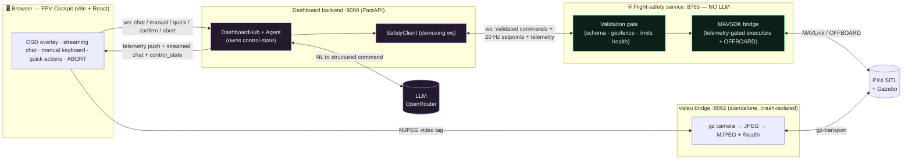

# LLM FPV Flight Assistant

> Картка виставки. Зал: [OSD](../halls/osd.md).

## Паспорт

| Поле | Значення |
|------|----------|
| Джерело | [alikendir0/llm-fpv-flight-assistant](https://github.com/alikendir0/llm-fpv-flight-assistant) |
| Локальна тека | `fpv-library/repos/llm-fpv-flight-assistant-Model-agnostic-LLM-copilot-for-an-FPV-dr` |
| У бібліотеці | keep |
| Категорії каталогу | `osd`, `tools`, `ai` |
| Зірки (каталог) | 0 |
| Оновлено upstream | 2026-06-09 |
| Ліцензія (з файлу LICENSE або згадки) | MIT |

## Ідея

**A model-agnostic LLM copilot for an FPV drone — natural-language command & control with a deterministic safety layer that keeps the AI out of the hard real-time loop.**

_З README.md, без переказу._

## Для чого

Model-agnostic LLM copilot for an FPV drone (PX4 + MAVLink, SITL-first): validated safety gate, manual OFFBOARD flight, streaming chat, immersive FPV/OSD web dashboard.

_Опис із каталогу бібліотеки (те, що було на GitHub на момент запису)._

## Для кого

Маркери в описі, темах і вступі (не здогадка понад текст):

- Пілот, якому потрібні окуляри, VTX або OSD — у тексті є «osd».
- Інженер радіолінка — у тексті є «mavlink».


## Функція

Окремого списку функцій у README немає.

Єдине формулювання функції, яке є в каталозі: Model-agnostic LLM copilot for an FPV drone (PX4 + MAVLink, SITL-first): validated safety gate, manual OFFBOARD flight, streaming chat, immersive FPV/OSD web dashboard.

## Як влаштовано

Корінь теки (без прихованих і без `node_modules` / `.git`):

- `build_pdf.py`
- `CLAUDE.md`
- `docs/`
- `evals/`
- `frontend/`
- `LICENSE`
- `llm-flight-assistant-research.md`
- `llm-flight-assistant-research.pdf`
- `pyproject.toml`
- `pytest.ini`
- `README.md`
- `ROADMAP.md`
- `scripts/`
- `src/`
- `tests/`

Типи файлів за вибіркою (143 файлів, глибина до 3): Python (79), TypeScript (28), Markdown (16), JSON (5), YAML (4), .png (3).

Фрагмент README про будову:

### Architecture

Three independent processes behind a hard trust boundary. The **LLM lives only on the assistant side** and can never reach the vehicle except through the validated safety API.



## Що треба

### Prerequisites

- PX4-Autopilot built for SITL with Gazebo (gz Harmonic) — see the PX4 docs.
- Python 3.11 (project venv) and Node.js for the frontend.
- An OpenRouter API key (or any OpenAI-compatible endpoint).

- Маніфести збірки: Python (pyproject.toml).
- pyproject name: `flight-safety`.

## Інструкція

Нижче скопійовані розділи README про встановлення, збірку або запуск. Команди не доповнювались.

### Install

```bash
python -m venv .venv && . .venv/bin/activate
pip install -e .
npm --prefix frontend install
cp .env.example .env        # then add your AS_OPENROUTER_API_KEY
```
Secrets live in `.env` (gitignored). `FS_GEOFENCE` must contain the SITL home (~47.398, 8.546) or commands are rejected as out-of-bounds.

## Супутні документи в теці

- [`docs/M1-followups.md`](../../fpv-library/repos/llm-fpv-flight-assistant-Model-agnostic-LLM-copilot-for-an-FPV-dr/docs/M1-followups.md)

## З чого зібрана картка

`catalog.json`, `fpv-library/repos/llm-fpv-flight-assistant-Model-agnostic-LLM-copilot-for-an-FPV-dr/README.md`, маніфести збірки в корені теки, якщо вони є.

Сторінка: `wiki/projects/alikendir0__llm-fpv-flight-assistant.md`.
